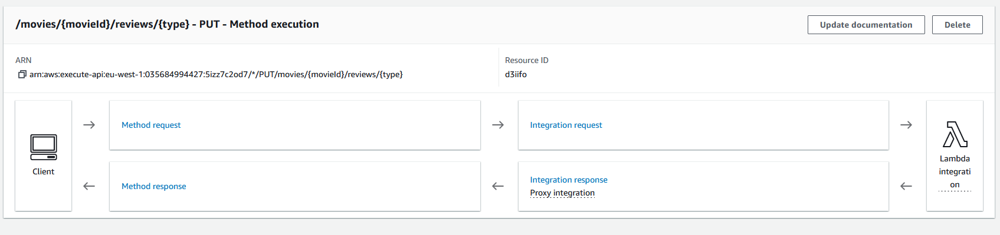

## ServerlessREST Assignment - Distributed Systems.

__Name:__ Cian Farrell

This repository contains the implementation of a serverless REST API for the AWS platform. A CDK stack creates the infrastructure. The domain context of the API is movie reviews.

## API endpoints.


### Reviews

+ POST /movies/reviews - add a movie review.
+ GET /movies/{movieId}/reviews - Get all the reviews for a movie with the specified ID.
+ GET /movies/{movieId}/reviews?minRating=n - Get all the reviews for the movie with the specified ID with a rating greater than the minRating.
+ GET /movies/{movieId}/reviews/{reviewerName} - Get the review for the movie with the specified movie ID and written by the named reviewer.
+ PUT /movies/{movieId}/reviews/{reviewerName} - Update the text of a review. (movie ID and reviewer username uniquely identify a review item).
+ GET /movies/{movieId}/reviews/{year} - Get the review(s) for the movie with the specified movie ID and were written in a specified year.
+ GET /movies/reviews/{reviewerName} - Get all the reviews written by a specific reviewer.
+ GET /movies/{movieId}/reviews/{reviewerName}/translation?language=code - Get a translated version of the review for the movie with the specified movie ID and written by the named reviewer.

### API Gateway Service


This image shows both the APIs that are added with this code.


**POST /movies/reviews**  
This image demonstrates the `addnewreview` endpoint. It accepts POST requests with a new review in the body, validating and adding the review to the DynamoDB database. It returns a success message or relevant error upon validation.


**GET /movies/{movieId}/reviews**  
This endpoint demonstrates `getreviewsbymovie`, returning all reviews for a specific movie.


**GET /movies/reviews/{reviewerName}**  
This image represents the `getreviewsbyname` endpoint, retrieving all reviews associated with a particular username across different movies.


**GET /movies/{movieId}/reviews/{type}** (Type can be either username or year)  
The `getreviewsbytype` endpoint retrieves reviews from a specific movie by the username of the reviewer or the year the review was made. It utilizes regex to differentiate the search type.


**GET /movies/{movieId}/reviews/{reviewerName}/translation?language=code**  
This endpoint, similar to `getreviewsbytype`, allows selection by username and returns a translated version of the review using AWS's translation service. It requires a language code for translation.


**PUT /movies/{movieId}/reviews/{reviewerName}**  
The `updatereview` endpoint is a PUT method, allowing users to update the contents of a review and optionally the rating parameter.

### Authentication.


- This image displays a confirmed user. The user creation process likely involved using JSON bodies in POST requests:
  - Signing up using the `/signup` endpoint by sending a JSON body with parameters (username, email, password).
  - Confirming the account using the `/signup_confirm` endpoint by sending a JSON body with parameters (username, code).
  - Signing in via the `/signin` endpoint with a JSON body containing parameters (username, password).


### Independent learning (If relevant).

I utilized AWS Translate to incorporate translation options for reviews, which is implemented within the following file:
```
./lamba/reviews/getTranslatedReview.ts
```
The Lambda function (`getTranslatedReview.ts`) uses AWS Translate to dynamically translate review text based on user-provided language codes. Using TranslateClient and TranslateTextCommand from the AWS SDK, it fetches reviews from DynamoDB and translates content on-the-fly. This enables users to access reviews in their preferred language, enhancing accessibility within the application.


### References

Giving access to `getTranslatedReview.ts` to allow for translations was written with help from [here](https://docs.aws.amazon.com/cdk/v2/guide/permissions.html).
